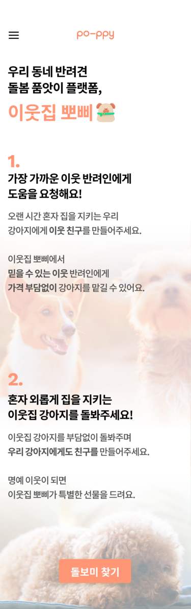
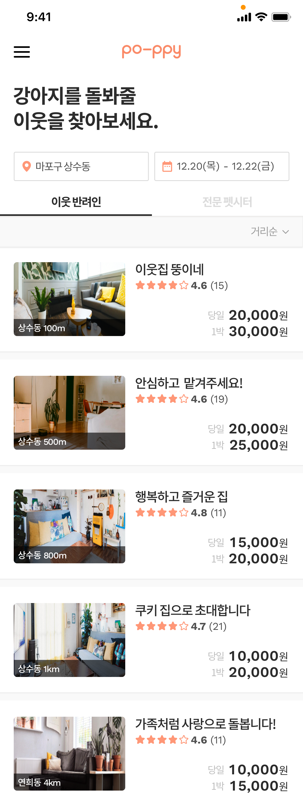
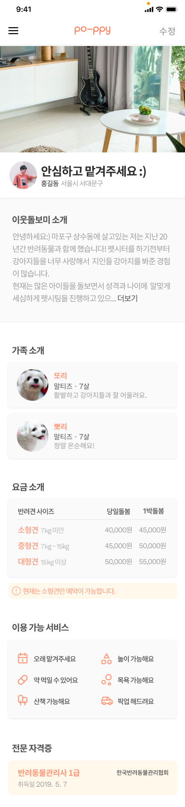

# My neighbor, Poppy Flatform Service

## Description

- 이웃 동네 반려견 돌봄 품앗이 서비스

- 


## IA


## Environment

- OS : Windows
- IDE : pycharm
- Version : Python 3.6.1


## Prerequisite

- Make a virtual environment

  ```shell
  $ cd poppy
  $ python3 -m venv myvenv
  ```
  
- Run virtual environment

  ```shell
  C:\Users\Name\poppy> myvenv\Scripts\activate
  ```

- Install Django

  - pip upgrade

    ```shell
    (myvenv) ~$ python3 -m pip install --upgrade pip
    ```

  - install Django

    ```shell
    (myvenv) ~$ pip install -r requirements.txt
    ```


## Usage

```shell
(myvenv) ~/polls_by_django$ python manage.py runserver
```


## Service imgs






